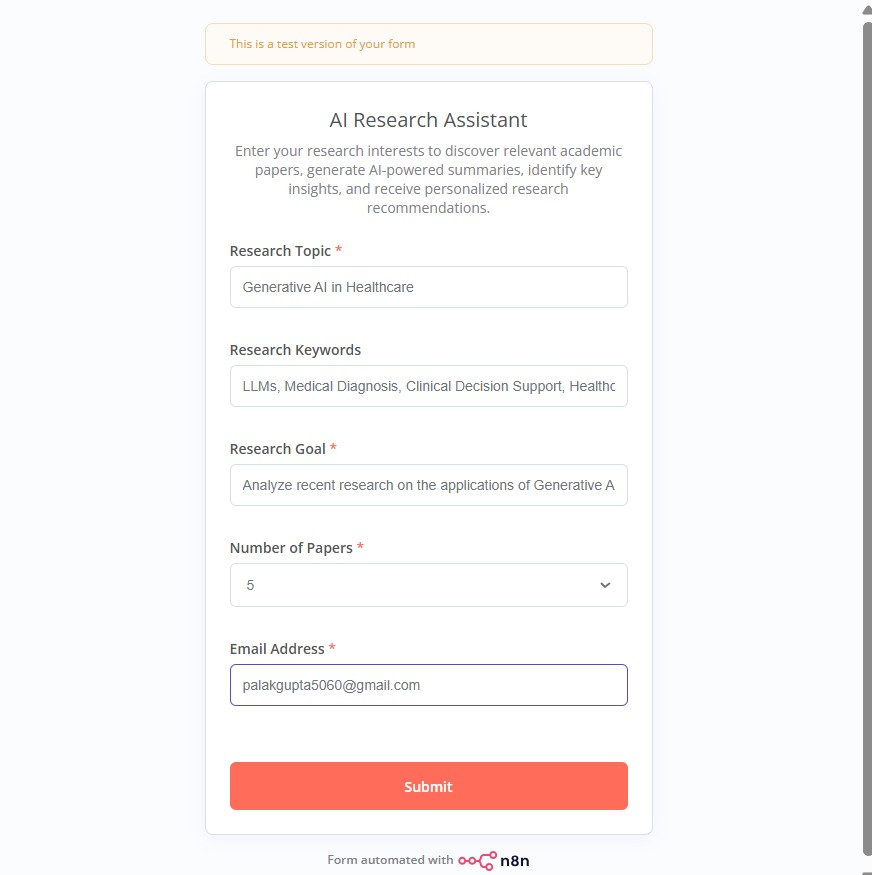
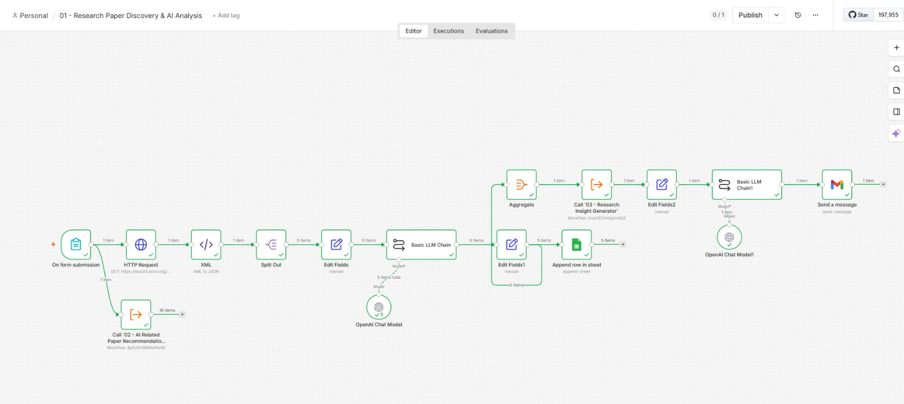
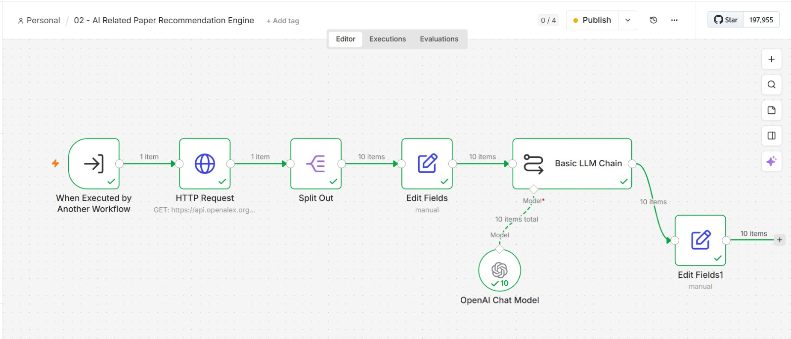
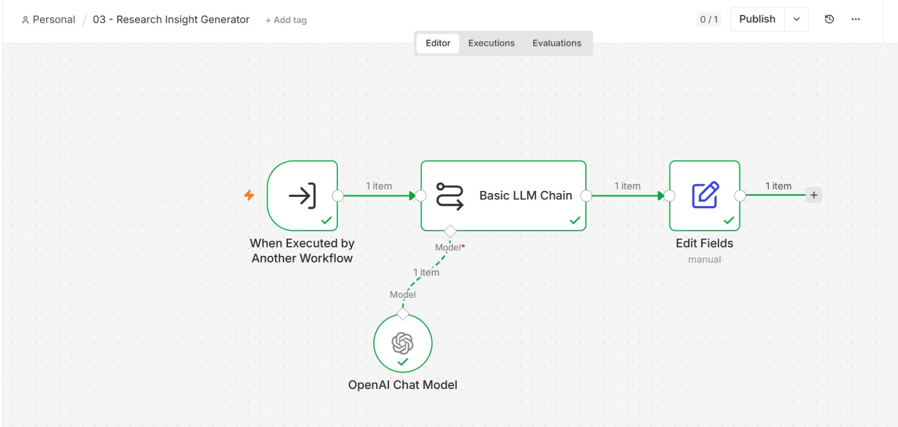
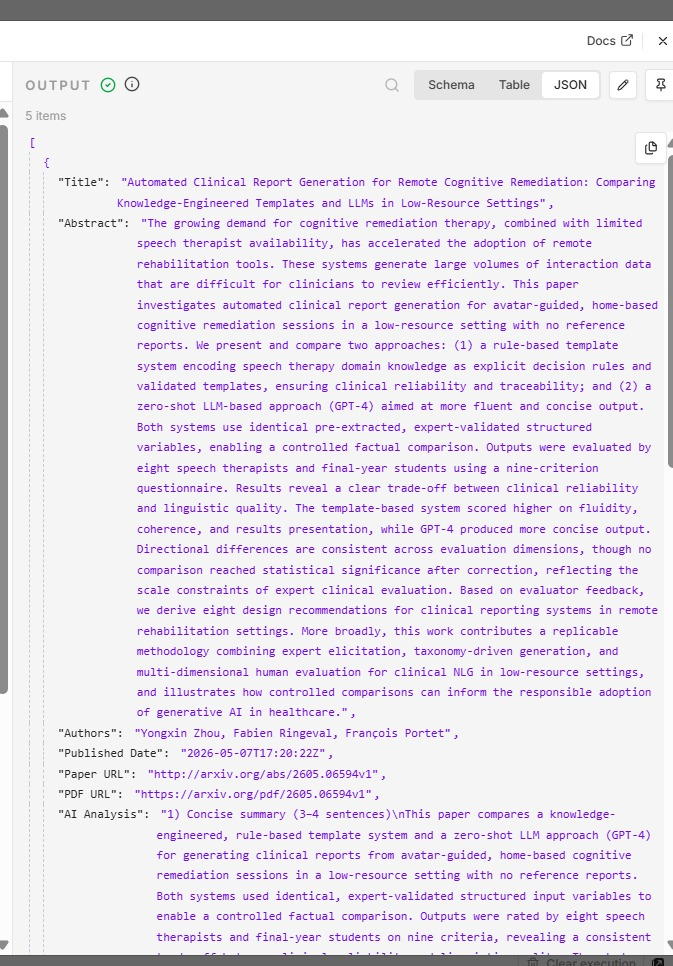
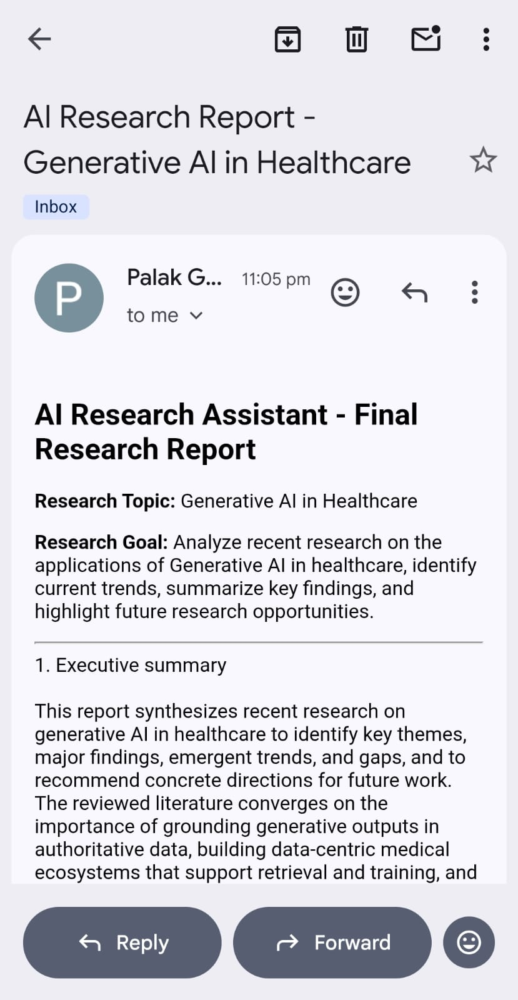

# 🤖 AI Research Assistant using n8n & Large Language Models


An AI-powered Research Assistant that automates literature review using **n8n**, **GPT-5 Mini**, **arXiv API**, **OpenAlex API**, **Google Sheets**, and **Gmail**.

The system automatically searches research papers, generates AI-powered summaries, recommends additional papers, produces research insights, and emails a structured research report to the user.

---

# 📖 Project Overview

Conducting a literature review is one of the most time-consuming tasks in research. Researchers spend hours searching for relevant papers, reading abstracts, comparing findings, identifying research gaps, and organizing information.

This project automates the complete literature review process using workflow automation and Large Language Models.

The AI Research Assistant can:

- 🔍 Search research papers automatically
- 🤖 Generate AI-powered summaries
- 📚 Recommend additional relevant papers
- 💡 Produce consolidated research insights
- 📊 Store analyzed papers in Google Sheets
- 📧 Automatically email a professional research report

---

# 🚀 Features

- Automated research paper discovery
- AI-powered paper summarization
- Related paper recommendation engine
- Research insight generation
- Google Sheets integration
- Gmail report generation
- End-to-end workflow automation
- Modular and scalable architecture

---

# 🏗️ System Architecture

```text
                User Form
                    │
                    ▼
      Workflow 1 – Research Paper Discovery
                    │
                    ▼
                arXiv API
                    │
                    ▼
            GPT-5 Mini Analysis
                    │
                    ▼
             Google Sheets Storage
                    │
                    ▼
      Workflow 2 – Paper Recommendation
                    │
                    ▼
              OpenAlex API
                    │
                    ▼
          GPT Recommendation Engine
                    │
                    ▼
      Workflow 3 – Research Insights
                    │
                    ▼
        Final AI Research Report
                    │
                    ▼
               Gmail Delivery
```

---

# 🔄 Workflow Description

## 📌 Workflow 1 – Research Paper Discovery

- Accepts user research topic
- Searches research papers using the arXiv API
- Parses XML responses
- Generates AI-powered summaries using GPT-5 Mini
- Stores analyzed papers in Google Sheets

---

## 📌 Workflow 2 – Paper Recommendation Engine

- Receives the research topic
- Searches OpenAlex for related papers
- Uses GPT to analyze relevance
- Returns AI-generated recommendations

---

## 📌 Workflow 3 – Research Insight Generator

- Combines analyses from previous workflows
- Identifies trends and key findings
- Generates consolidated research insights
- Produces the final report
- Sends the report through Gmail

---

# 🛠️ Technology Stack

| Technology | Purpose |
|------------|---------|
| n8n | Workflow Automation |
| GPT-5 Mini | AI Analysis |
| OpenAI | Large Language Model |
| arXiv API | Research Paper Search |
| OpenAlex API | Related Paper Discovery |
| Google Sheets | Data Storage |
| Gmail | Email Delivery |
| HTTP Request | API Communication |
| XML Parser | Response Processing |

---

# 📂 Repository Structure

```text
AI-Research-Assistant-n8n/

│── workflows/
│   ├── workflow-01-research-paper-discovery.json
│   ├── workflow-02-paper-recommendation.json
│   └── workflow-03-research-insights.json

│── screenshots/
│   ├── user-form.jpeg
│   ├── workflow-01.jpeg
│   ├── workflow-02.jpeg
│   ├── workflow-03.jpeg
│   ├── google-sheets-output.jpeg
│   └── gmail-report.jpeg

│── presentation/
│── report/
│── assets/
│── docs/

└── README.md
```

---

# 📸 Project Screenshots

## User Input Form



---

## Workflow 1



---

## Workflow 2



---

## Workflow 3



---

## Google Sheets Output



---

## Final Email Report



---

# ⚙️ Installation

### 1. Clone the repository

```bash
git clone https://github.com/palakgupta5060/AI-Research-Assistant-n8n.git
```

### 2. Import the workflows

Import all three JSON workflow files into your n8n instance.

### 3. Configure credentials

Set up:

- OpenAI API
- Gmail
- Google Sheets

### 4. Activate the workflows

Activate all three workflows.

### 5. Run the application

Open the n8n Form, enter your research details, and submit the request.

---

# 🎯 Example Input

**Research Topic**

Generative AI in Healthcare

**Keywords**

LLMs, Medical Diagnosis, Clinical Decision Support, Healthcare AI

**Research Goal**

Analyze recent developments in Generative AI for healthcare, summarize key findings, identify emerging trends, and highlight future research opportunities.

---

# 🔮 Future Scope

- IEEE Xplore Integration
- Springer Integration
- PDF Research Paper Analysis
- Automatic Citation Generation
- Vector Database Integration
- Retrieval-Augmented Generation (RAG)
- Multi-Agent AI Research Assistant

---

# 👩‍💻 Author

**Palak Gupta**

B.Tech – Electronics & Computer Engineering

Summer School Project – IIT Jammu

---

# 📄 License

This project is licensed under the **MIT License**.

---

⭐ If you found this project useful, consider giving it a **Star** on GitHub!
